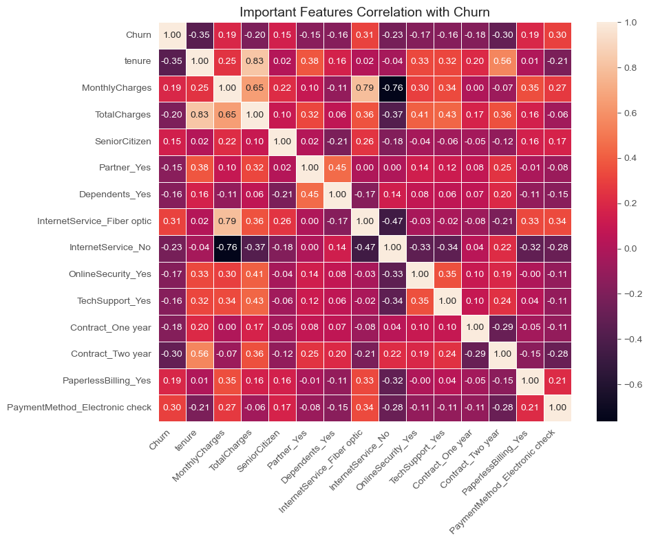
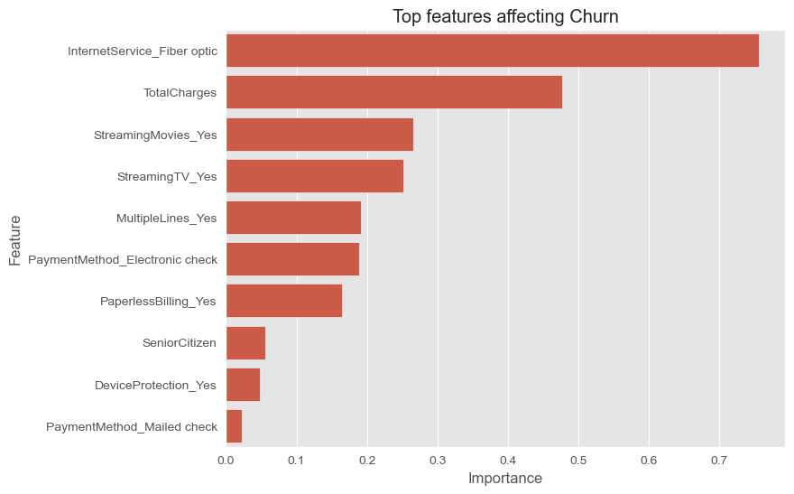
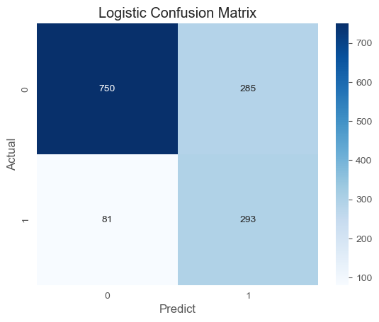
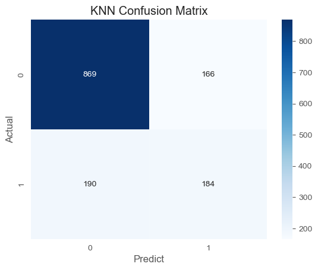
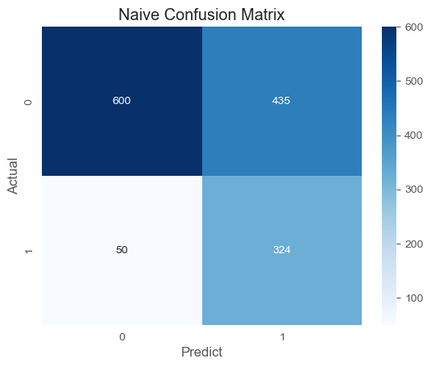
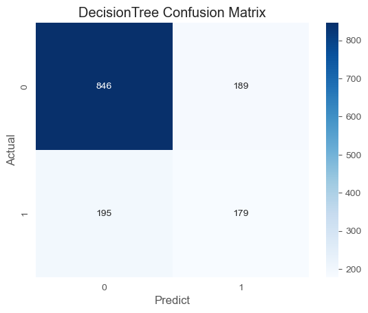

# 📊 Customer Churn Prediction

## 📌 Project Overview
This project predicts customer churn using Machine Learning models.

## ⚙️ Models Used
- Logistic Regression
- KNN
- Naive Bayes
- Decision Tree

## 📊 Key Insights
- Fiber optic users have higher churn
- Month-to-month contracts have highest churn
- Logistic Regression performed best

## 📷 Visualizations

## 🚀 Tech Stack
- Python
- Pandas
- NumPy
- Scikit-learn
- Matplotlib / Seaborn

## 🎯 Conclusion
This model helps businesses identify at-risk customers and take preventive actions.
